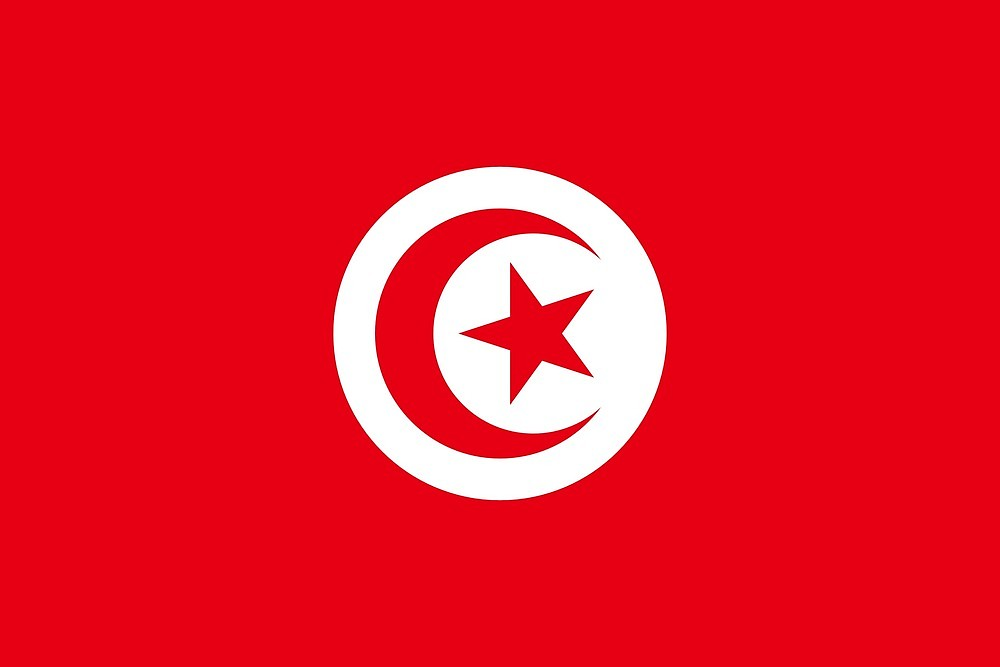

# Tunisian - Population & Municipalites 🇹🇳🪐
--- 

<!-- ⚠️ : merge the 3imed-jaberi-patch-1 -->



[](https://travis-ci.org/3imed-jaberi/population-tn)

[](https://coveralls.io/github/3imed-jaberi/population-tn?branch=master)


#### __`Population-Tn`__ allow you to get all tunisian cities populations for the date January 2019.


> Link of the dataset [OpenGov](https://www.data4tunisia.org/en/datasets/twzy-dd-lskn-wlmsh-lkl-bldy-tqdyrt-jnfy-2019-1/#resource-c4b7ac62-915f-4beb-98a1-19ecded1c4c2).


### Installation 
---

- NPM :
```bash
$ npm install population-tn
```

### Usage 
---

Step 1 : Import the module in this way.

```javascript
$ const populations = require('population-tn');
```

Step 2 : 

 - Get Population_Municipalites : 

```javascript
$ populations.getPopulations();
```

- Get Governorate by Governorate Code : 

```javascript
$ populations.getByCode_Gouvernorat(gov_code);
```

- Get Governorate by Municiaplity Code  :

```javascript
$ populations.getByCode_Municipalite(muni_code);
```

  <!-- 
    * should update the readme or create docs site for all details with MuniciaplityCode && GovernorateCode.
    * should update the code example.
    * should update the core code export.
  -->

### Contributing 
---
###### Keep it simple. Keep it minimal. Don't put every single feature just because you can.


### Authors / Contributors / Acknowledgments
---
 - Ahmed Rebai @Rebaiahmed
 - Imed Jaberi @3imed-jaberi


#### License
---
[MIT](https://choosealicense.com/licenses/mit/)
